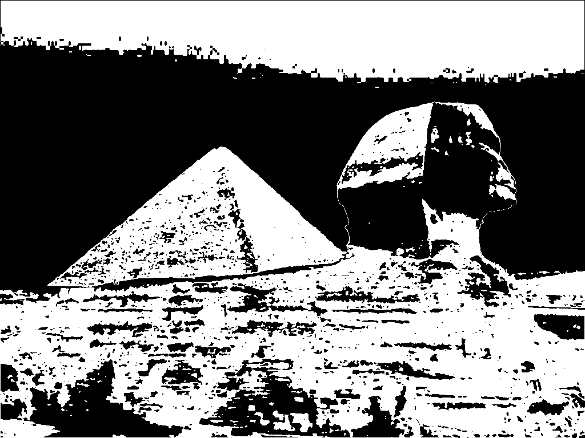

# 🖼️ Comparative Review of Image Segmentation Algorithms: Chan-Vese, K-Means & Otsu  

## 📌 Project Overview  
This project presents a **comparative review** of three widely used **image segmentation algorithms**: **Chan-Vese**, **K-Means**, and **Otsu**.  

Our goal is to **evaluate, implement, and compare** these algorithms in terms of **accuracy, efficiency, and robustness** when applied to different types of images.  

The project includes:  
- 📖 **Mathematical foundations** (detailed in the report).  
- 💻 **C++ implementations** of all three algorithms (using OpenCV).  
- 🧪 **Comparative tests** with real image examples.  
- 📊 **Performance analysis**: accuracy, execution time, and computational efficiency.  

---

## ⚙️ Algorithms Reviewed  

### 1. **Chan-Vese Algorithm**  
- Region-based active contour model.  
- Segments based on **intensity homogeneity** rather than gradient.  
- Strong for medical images and noisy datasets.  

### 2. **K-Means Clustering**  
- Groups pixels into **K clusters** based on intensity/color similarity.  
- Simple and efficient for multi-class segmentation.  
- Sensitive to initialization and number of clusters.  

### 3. **Otsu’s Method**  
- **Automatic thresholding** technique.  
- Maximizes **inter-class variance** to separate foreground and background.  
- Very efficient for **bi-modal histograms**.  

---

## 🎯 Objectives  
- ✅ Implement the three segmentation algorithms in **C++**.  
- ✅ Compare their performance on a set of benchmark images.  
- ✅ Assess segmentation quality in terms of **accuracy, execution time, and efficiency**.  
- ✅ Provide a **report** with mathematical explanations, theoretical background, and discussion of strengths/weaknesses.  

---

## 📂 What’s Inside  

- **`/src/`** → C++ source code for Chan-Vese, K-Means, and Otsu.  
- **`/Results/`** → Segmented output images for each algorithm.  
- **`Project_report.pdf`** → Detailed mathematical background + comparative analysis.  
- **`README.md`** (this file).  

---

## 🧪 Example Tests  

Here are sample comparisons between the three methods:  

| Original Image | Chan-Vese | K-Means | Otsu |  
|----------------|-----------|---------|------|  
|  |  |  |  |  

> The **mathematical derivations and theoretical insights** behind these results are explained in detail in the **report**.  

---

## 🚀 Getting Started  

### Requirements  
- C++ compiler (GCC, Clang, MSVC)  
- [OpenCV](https://opencv.org/)  

### Run Instructions  
```bash
# Clone this repository
git clone https://github.com/username/segmentation-comparison.git
cd segmentation-comparison

# Compile the code (example with g++)
g++ -o segment main.cpp `pkg-config --cflags --libs opencv4`
```

The segmented results will be displayed and saved under **`/results/`**.

---

## 📊 Expected Output

For each test image, you’ll obtain:

- Chan-Vese segmentation result.  
- K-Means segmentation result.  
- Otsu segmentation result.  

All results are saved in the **results directory**.

---

## 🔮 Future Work

- ⏩ **Optimization** for large-scale images.  
- 🧠 **Machine learning integration** for adaptive parameter selection.  
- 🩺 **3D extension** to medical images (MRI, CT scans).  

---

## 👩‍💻 Contributors

- **Hana Feki** – [hana.feki@ensta.fr](mailto:hana.feki@ensta.fr)  
- **Rayen Mansour** – [rayen.mansour@ensta.fr](mailto:rayen.mansour@ensta.fr)  
- **Rayen Zargui** – [rayen.zargui@ensta.fr](mailto:rayen.zargui@ensta.fr)  


# Run with an input image
./segment path/to/image.jpg
